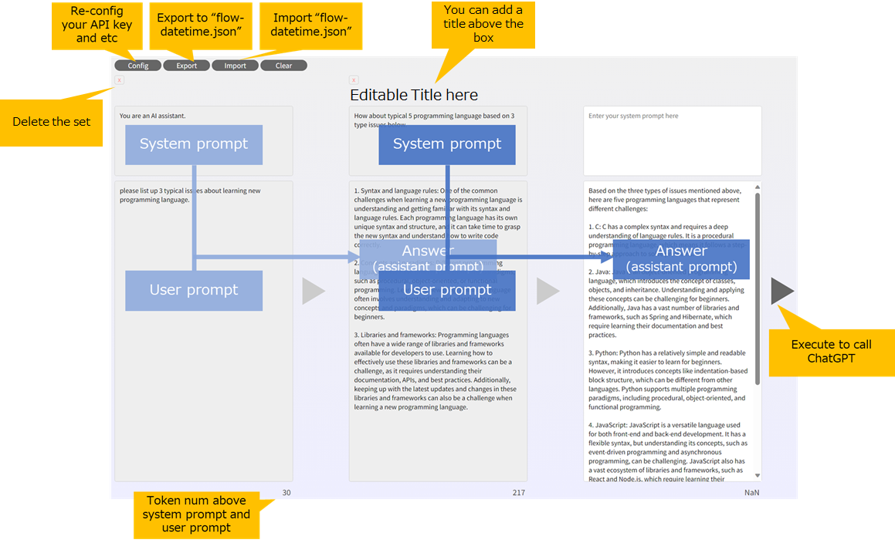

# Horizontal ChatGPT

This is a horizontal version of ChatGPT deployed on Azure StaticWebApps using Azure OpenAI Services. Unlike the traditional vertical ChatGPT, this version offers a different approach to conversational AI.

## Usage

Using Horizontal ChatGPT is simple. You only need to provide the following initial configurations:

- Azure OpenAI Services endpoint
- Azure OpenAI Services ChatGPT model name
- Azure OpenAI Services API Key

## Deployment

The Horizontal ChatGPT is deployed on Azure StaticWebApps and can be accessed using the following URL: [https://salmon-beach-093e71f00.3.azurestaticapps.net/](https://salmon-beach-093e71f00.3.azurestaticapps.net/).

## Functionality

Horizontal ChatGPT leverages Azure OpenAI Services to process user inputs and generate responses. It is designed for advanced analysis and complex processing tasks. Unlike the raw OpenAI Service, this version offers enhanced capabilities.

## Instructions

Here are the instructions for use:

1. Enter the system prompt and user prompt.
2. Click the triangle button to display the response to the next set of user prompts.
3. You can edit the text or add new user prompts as needed.
4. Click the Export button to export the current situation.
5. Click the Import button to import a previously exported situation.
6. You can display a title above each set.
7. Each set can be deleted individually.

Please use according to your preference.

## Data Privacy

Please note that no user input or key information is stored by this application. However, if you have concerns, you can either regenerate your keys regularly or clone this repository and deploy it on your own Azure StaticWebApps instance after reviewing the code.

Feel free to explore and experiment with Horizontal ChatGPT!